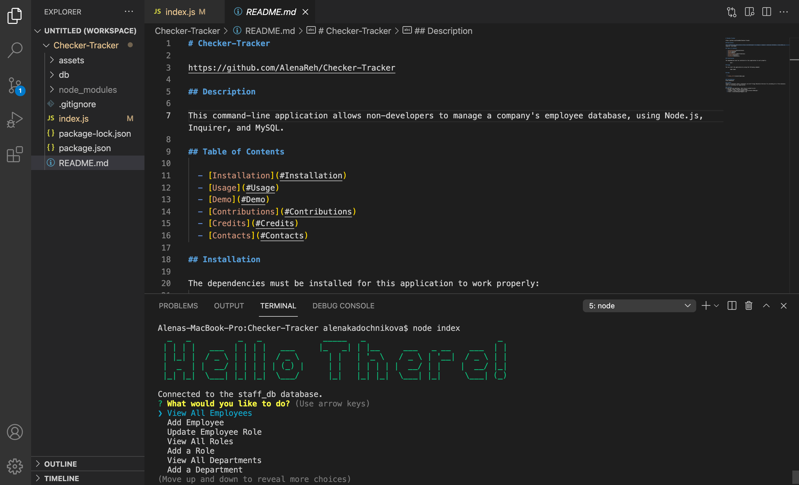

# Checker-Tracker

https://github.com/AlenaReh/Checker-Tracker

## Description 

This command-line application allows non-developers to manage a company's employee database, using Node.js, Inquirer, and MySQL.

## Table of Contents

  - [Installation](#Installation)
  - [Usage](#Usage)
  - [Demo](#Demo)
  - [Contributions](#Contributions)
  - [Credits](#Credits)
  - [Contacts](#Contacts)
  
## Installation 

The dependencies must be installed for this application to work properly: 

        npm i

## Usage

You can start the application by using the following command:

        node index

## Demo 

  
  

## Contributions
Alena Rehberger

## Credits
Thanks to w3schools https://w3schools.com and Trilogy Education Services for providing all of the necessery tools for building this application.

## Contacts
If you have any questions, feel free to cantact me at: 
  * GitHub: https://github.com/AlenaReh
  * Linkedin: https://www.linkedin.com/in/alena-rehberger/
  * E-mail: alenarehberger92@gmail.com